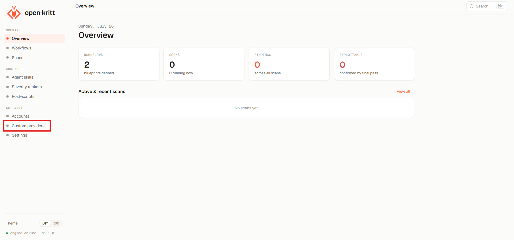
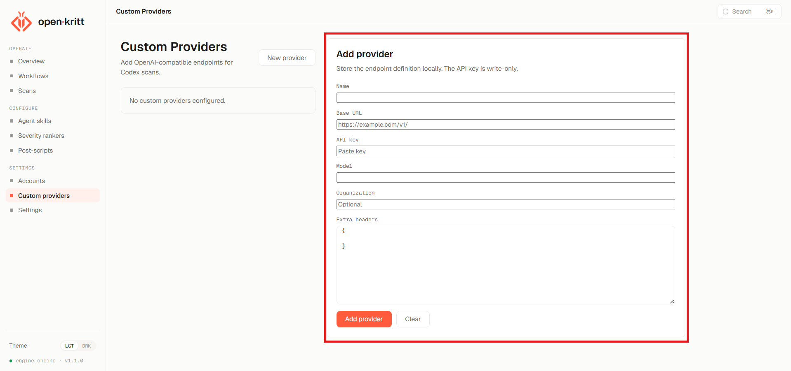
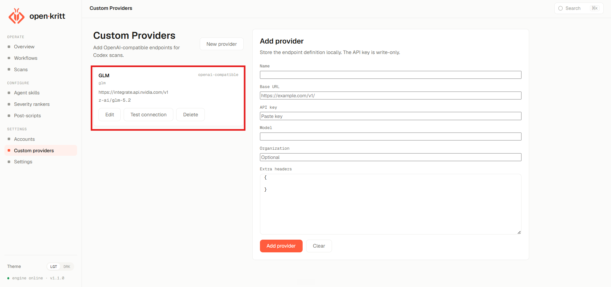
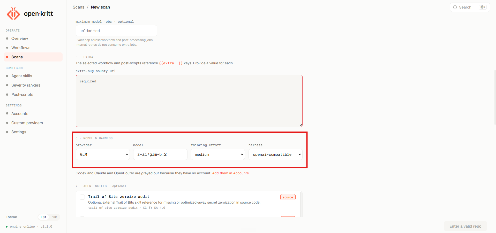

<p align="center">
  
</p>

#  Open Kritt Custom

> A customized version of Open Kritt with support for custom AI providers and OpenAI-compatible APIs.

---

# 📖 Introduction

Open Kritt Custom is a customized fork of the original **Open Kritt** project that extends its provider architecture to support custom AI providers and OpenAI-compatible APIs.

The primary goal of this fork is to make model integration more flexible by allowing developers to connect custom providers, configure OpenAI-compatible endpoints, and register their own models without being limited to the project's built-in integrations.

---

# ✨ Features Added

## 🔌 Custom AI Provider Integration

- Register and configure custom AI providers
- Connect any OpenAI-compatible API
- Configure custom API endpoints and authentication

## 🤖 Flexible Model Management

- Register provider-specific models
- Organize and switch between available models
- Support custom model catalogs

# 🚀 Getting Started

## 📦 Prerequisites

Before getting started, ensure the following are installed on your system:

- Docker
- Docker Compose
- Git

---

## ⚡ Installation

### 1️⃣ Clone the Repository

```bash
git clone https://github.com/itsdarktoday/open-kritt-custom.git
cd open-kritt-custom
```

### 2️⃣ Build the Application

```bash
docker compose build --no-cache
```

### 3️⃣ Start the Application

```bash
docker compose up
```

Run in the background:

```bash
docker compose up -d
```

### 4️⃣ Access the Application

Once all services are running, open:

```
http://localhost:5173
```

The frontend, backend, engine, and database will start automatically via Docker Compose.

---

# ⚙️ Adding Custom Providers


Manage all configured providers from a single dashboard.

---


Configure:

- **Name**
- **Base URL**
- **API Key**
- **Model**
- **Organization** (optional)
- **Extra Headers** (optional)

---


You can test, edit or delete the configured provider. Along with add new.

---


Once added, your provider automatically appears when creating a new scan.

---

# 🙌 Credits

This project is based on the original **Open Kritt** project.

## 👨‍💻 Maintainer

**@itsdarktoday**

🐙 GitHub: https://github.com/itsdarktoday

𝕏 X: https://x.com/0xitsdarktoday

📝 Medium: [@itsdarktoday](https://medium.com/@itsdarktoday)

---

## 🤝 Contributor

**@0xscarfac3**

🐙 GitHub: https://github.com/0xscarfac3

𝕏 X: https://x.com/0Xscarfac3

📝 Medium: [@0xscarfac3](https://medium.com/@0xscarfac3)

---

### 📜 Note

This is a custom version of **Open Kritt v1.2.0**.
